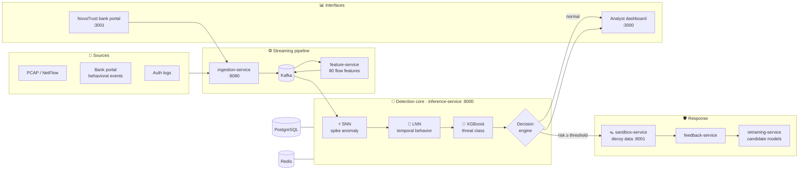
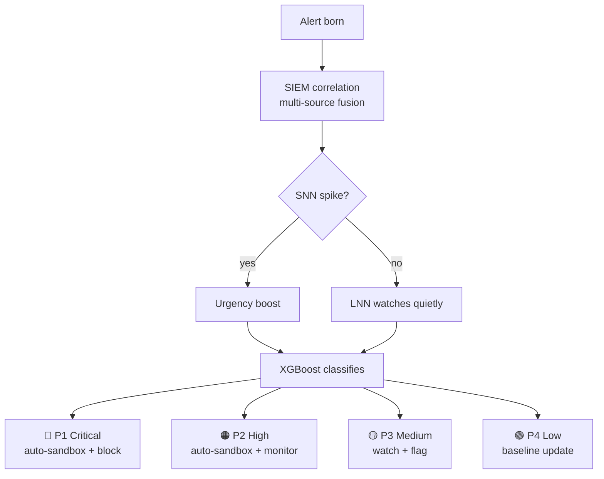
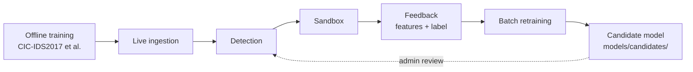
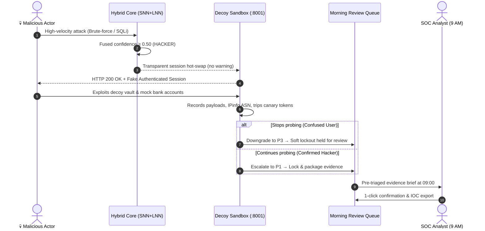

<div align="center">

<a id="top"></a>

# 🧠 NeuroSOC

### Neuromorphic AI Security Operations Center

*Thinking like a brain. Defending like a fortress.*

[](#-built-for-the-cyreneai-hackathon)
[](LICENSE)


**[Why NeuroSOC](#-why-neurosoc)** ·
**[Architecture](#architecture)** ·
**[Features](#-platform-features)** ·
**[Detection Engine](#-snn--lnn-hybrid-engine)** ·
**[User Personas & Sandboxing](#personas)** ·
**[SDK & Demo](#-novatrust-demo-the-whole-sdk-pipeline-in-one-sandbox)** ·
**[Models & Accuracy](#-models-and-measured-accuracy)** ·
**[Quick Start](#-quick-start)** ·
**[Roadmap](#roadmap)** ·
**[Documentation](#-documentation)** ·
**[References](#-references)**

</div>

---

## 🏆 Built for the CyreneAI Hackathon

> [!NOTE]
> **NeuroSOC was built for the CyreneAI Hackathon.** It is an AI-first Security Operations Center that works like a tireless junior SOC analyst: it detects threats, triages alerts, moves suspicious sessions into a decoy sandbox overnight, and hands a human a short, evidence-backed queue in the morning.

**The pitch in 30 seconds:**

| | |
|---|---|
| 😩 **The problem** | SIEMs fire thousands of alerts a day. Analysts read a fraction, attackers hide in the noise, and nobody responds at 2 AM. |
| 💡 **Our answer** | A **Spiking + Liquid Neural Network** hybrid that scores each event against *that entity's own* behavior, then **acts on the result**: it sandboxes, deceives, collects evidence and reports. |
| 🎯 **The outcome** | The analyst starts the day with **about 10 pre-triaged cases with evidence** instead of 10,000 raw alerts, and still makes the final call. |

📘 **Detailed design doc:** [Google Docs](https://docs.google.com/document/d/1GcDYW006dY0nc87Vipmqk0Oph9lL2IFMOXp71v2yV8w/edit?tab=t.jpmwkbfntfso)

▶️ **Demo video:** [Watch the NeuroSOC demo on YouTube](https://youtu.be/eUf58W-rJoE)

**At a glance**

- 🧠 **Three models, one verdict.** An SNN catches sudden bursts, an LNN follows how behavior evolves, and XGBoost makes the final call. On the public CIC-IDS2017 and CIC-DDoS2019 test data XGBoost reaches **99.6% accuracy (0.961 macro F1)** and the sequence models reach 90 to 92% ([details](#-models-and-measured-accuracy)).
- 🧩 **A drop-in SDK for apps and AI agents.** `pip install neurosoc` (live on [PyPI](https://pypi.org/project/neurosoc/)) plus a browser script. Every agent tool call is checked before it runs, and a hijacked or unregistered agent is stopped outside the language model.
- 🏦 **Proven end to end.** The NovaTrust demo walks the full loop (onboard, integrate, observe, analyze, decide, protect, visualize) with the real SDKs, and a browser end-to-end run passes 19 of 19 steps ([report](docs/DEMO_TEST_REPORT.md)).
- 🔁 **Human in the loop.** Sandbox sessions and analyst decisions become labeled data; retrained models are staged as candidates and promoted only after an administrator approves.
- 📚 **Documented in four volumes.** The [Technical Specification Series](#-documentation) covers the architecture, the detection engine, the services and APIs, and the SDK.

---

## 🧠 Why NeuroSOC

Traditional SIEMs (Splunk, QRadar, Microsoft Sentinel) and IDSs are **loud and passive**. They correlate logs, fire alerts and leave the rest to a human.

| Problem with classic SIEM / IDS | How NeuroSOC handles it |
|---|---|
| 10,000 alerts a day, of which the analyst reads 200 | The SNN + LNN hybrid reduces noise to ranked, actionable signals |
| An alert fires and the analyst investigates by hand | An alert fires and the system sandboxes the session and collects evidence |
| No action at 2 AM | An autonomous overnight loop acts; a human reviews the evidence at 9 AM |
| Can't tell a forgetful user from a hacker | The LNN builds a behavioral fingerprint for each entity over time |
| The SIEM only displays events | The system detects, decides, diverts, deceives and reports |

<p align="right"><a href="#top">⬆ back to top</a></p>

---

<a id="architecture"></a>

## 🏗️ Architecture



<details>
<summary><b>🔍 Expand the full platform diagram (ingestion → SIEM core → sandbox → morning review)</b></summary>

```text
╔═══════════════════════════════════════════════════════════════╗
║                      NEUROSOC PLATFORM                        ║
╠═══════════════════════════════════════════════════════════════╣
║  ┌─────────────────────────────────────────────────────────┐  ║
║  │               INGESTION LAYER                           │  ║
║  │  🏦 DB Query Logs    🌐 Network Packets  📋 Auth Logs   │  ║
║  │  ☁️  Cloud Trails    💻 Endpoint EDR     📡 Syslog      │  ║
║  │     → Secure read-only connectors (per source type)     │  ║
║  └──────────────────────────┬──────────────────────────────┘  ║
║                             ▼                                 ║
║  ┌─────────────────────────────────────────────────────────┐  ║
║  │           NORMALIZATION ENGINE                          │  ║
║  │  Raw events → versioned security-event schema           │  ║
║  │  Timestamp sync │ Dedup │ Enrichment │ Entity tagging   │  ║
║  └──────────────────────────┬──────────────────────────────┘  ║
║                             ▼                                 ║
║  ╔═════════════════════════════════════════════════════════╗  ║
║  ║        NEUROSOC SIEM CORE                               ║  ║
║  ║  EVENT STORE ───▶ CORRELATION ENGINE (rules + ML)       ║  ║
║  ║                        ▼                                ║  ║
║  ║  SNN + LNN HYBRID DETECTION                             ║  ║
║  ║   ⚡ SNN → spike-encodes events, fires on bursts        ║  ║
║  ║   🌊 LNN → continuous state, tracks behavior            ║  ║
║  ║                        ▼                                ║  ║
║  ║  ALERT ENGINE 🚨                                        ║  ║
║  ║   P1 🔴 CRITICAL → immediate sandbox + block            ║  ║
║  ║   P2 🟠 HIGH     → sandbox + monitor                    ║  ║
║  ║   P3 🟡 MEDIUM   → flag + watch for escalation          ║  ║
║  ║   P4 🟢 LOW      → log only, update baseline            ║  ║
║  ║                        ▼                                ║  ║
║  ║  CLASSIFICATION: Normal │ Notorious │ Insider │ Attacker║  ║
║  ╚════════════════════════╪════════════════════════════════╝  ║
║           ┌───────────────┴────────────┐                      ║
║   RISK < THRESHOLD              RISK ≥ THRESHOLD              ║
║   → normal service              → 🪤 HONEYPOT SANDBOX         ║
║                                   decoy data, full capture    ║
║                     ┌───────────────┴──────────────┐          ║
║              Keeps exploiting               Stops / lost      ║
║              [P1 → HACKER]              [P3 → verify user]    ║
║                                     ▼                         ║
║              📊 MORNING ANALYST DASHBOARD                     ║
║              Ranked queue │ Sandbox replay │ Override         ║
╚═══════════════════════════════════════════════════════════════╝
```

</details>

<details>
<summary><b>🚨 Expand the SIEM layer in depth: correlation, alert tiers, alert-fatigue controls</b></summary>

#### 1. Event correlation

Individual events are weak signals. The correlation engine links them across sources:

```text
Event A:  User "john" failed login         [alone: noise]
Event B:  Same IP queried /admin 3x        [alone: noise]
Event C:  New device fingerprint for john  [alone: noise]
────────────────────────────────────────────────────────
Correlated → "Credential stuffing on john" → P2 alert
```

#### 2. Alert tiers and lifecycle



#### 3. Alert-fatigue controls

- **SNN deduplication:** identical spike patterns within a time window collapse into one alert.
- **Baseline-relative scoring:** an event alerts only if it deviates from *that entity's* baseline, not from a global threshold.
- **Sandbox auto-triage:** P1/P2 alerts are handled overnight, so the morning queue holds *resolved cases with evidence*.

</details>

<p align="right"><a href="#top">⬆ back to top</a></p>

---

## 🚀 Platform Features

NeuroSOC provides an end-to-end autonomous defense stack designed for modern high-velocity security operations. For the exhaustive technical specification and 80-feature contract, see [`docs/FEATURES.md`](docs/FEATURES.md).

| Domain | Key Capabilities | Implementation |
|---|---|---|
| 🧠 **Neuromorphic AI Core** | Event-driven spike-burst anomaly detection, continuous liquid-state temporal tracking, a 7-class threat taxonomy (6 classes have training data), and deterministic tree-logic safety overrides. | Norse (LIF SNN) + Liquid Reservoir LNN + XGBoost |
| 📡 **Multi-Modal Streaming** | Real-time intake of PCAP file streams, NetFlow (UDP 2055), Linux/Unix Syslog (RFC 3164/5424 UDP 5140), and browser behavioral telemetry. | `ingestion-service` + Apache Kafka (`raw-packets`) |
| ⚙️ **80-Feature Flow Engine** | Bidirectional TCP/UDP flow assembly, extraction of 80 statistical flow features (IAT, packet moments, flag ratios), LRU 100k flow table, deterministic MinMax scaling. | `feature-service` + `extracted-features` |
| 🧬 **Behavioral Profiler** | Continuous per-entity baseline tracking measuring keystroke cadence, mouse entropy, temporal hours, and request speed to compute $\Delta_{\text{Behavioral}}$. | `inference-service/core/behavioral` |
| 🪤 **Autonomous Deception** | Stealth session diversion ($\ge 0.50$ confidence) to high-interaction honeypot with decoy accounts ($1.2M+), synthetic transfers, honey-vault, and canary tokens. | `sandbox-service` (:8001) |
| 🔁 **Closed-Loop Retraining** | Automated label harvesting from sandbox actions, cryptographic held-out regression benchmark gate, staged candidates, and audited 1-click promotion/rollback. | `feedback-service` + `retraining-service` |
| 🧩 **SDK & Agent Guard** | Browser and Python SDKs score people, wallets and AI agents against their own baselines; an application and agent registry blocks unregistered agents, unlisted tools, unauthorized resources and sensitive-action bursts before the tool runs; Monitor and Protect modes. | `sdk/` ([`neurosoc` on PyPI](https://pypi.org/project/neurosoc/)) + `inference-service/core/universal` |
| 📊 **Analyst & Demo Portals** | Real-time WebSocket live alert streaming, interactive threat map, candidate model promotion panel, and NovaTrust Bank dark fintech simulation portal. | `dashboard` (:3000) + `simulation_portal` (:3001) |
| 🔐 **Zero-Trust Hardening** | Tenant-scoped append-only SHA-256 audit hash chain, Redis cross-replica atomic rate limiting, Keycloak OIDC/RBAC, and `sslmode=verify-full` TLS checks. | PostgreSQL + Redis + Keycloak (:8081) |
| 📈 **Cloud Observability** | Standardized Prometheus `/metrics` across all services, pre-provisioned Grafana dashboards, automated alerting webhooks, and daily SMTP digests at 06:00. | Prometheus (:9090) + Grafana (:3002) |

---

## 🔬 SNN + LNN Hybrid Engine

The core research idea is a detection engine that combines **Spiking Neural Networks** with **Liquid Neural Networks**:

| Model | Role | Implementation |
|---|---|---|
| ⚡ **SNN** | Encodes flow features as temporal spikes for fast, event-driven anomaly detection | Norse (PyTorch) · [`inference-service/core/snn`](inference-service/core/snn) |
| 🌊 **LNN** | Keeps a continuous-time state for each entity that tracks behavior as it evolves | Liquid reservoir + classifier · [`inference-service/core/lnn`](inference-service/core/lnn) |
| 🌳 **XGBoost** | Assigns the final threat class | [`inference-service/core/xgboost`](inference-service/core/xgboost) |
| 🧬 **Behavioral profiler** | Measures how far a session drifts from the user's own baseline | [`inference-service/core/behavioral`](inference-service/core/behavioral) |

```python
# Hybrid decision fusion (simplified)
snn_score   = snn_encoder.anomaly_score(packet_spike_train)
lnn_class   = lnn_classifier.predict(session_feature_sequence)
behav_delta = behavioral_profiler.get_delta(user_id, session_vector)

confidence  = 0.4 * snn_score + 0.4 * lnn_class + 0.2 * behav_delta
verdict     = decision_engine.classify(confidence, user_context)
```

<details>
<summary><b>📈 How the models behave in training and at runtime</b></summary>

| Model | Before ingestion | During runtime |
|---|---|---|
| **SNN** | Trained offline | Mostly static (fast inference) |
| **LNN** | Trained offline | Adaptive state (live context) |
| **XGBoost** | Trained offline | Retrained on a schedule from feedback |

**Closed learning loop:**



> [!IMPORTANT]
> Live inference must use exactly the same feature pipeline as training (80 CICFlowMeter-style features, MinMax scaling), or the models become invalid. Retraining only writes **candidate** artifacts. It never changes the active model, and reloading a model requires an OIDC **admin** token.

</details>

<p align="right"><a href="#top">⬆ back to top</a></p>

---

<a id="personas"></a>

## 🔁 The NeuroSOC Interactive Sandbox: User Personas

A hard operational problem is telling a **malicious actor** apart from a **legitimate user acting oddly**. NeuroSOC's sandboxing mechanism dynamically isolates sessions based on behavioral drift, tricking attackers while safely handling confused users.

Here is how the system treats three distinct user personas:

<details>
<summary><b>1️⃣ The Normal User (e.g., Priya)</b></summary>

**Behavior:** Logs in from her usual phone at a normal hour to check her balance.
**NeuroSOC Reaction:** 
- The Liquid Neural Network (LNN) recognizes her pattern. The Spiking Neural Network (SNN) sees no burst activity.
- **Verdict:** Access granted. The event is logged quietly to update her baseline.
</details>

<details>
<summary><b>2️⃣ The Dumb/Forgetful User (e.g., Raj, ex-employee)</b></summary>

**Behavior:** Tries to log in at 2 AM using an old device and fails the password 4 times because he forgot his access was revoked.
**NeuroSOC Reaction:** 
- The SNN detects a mild spike. The LNN detects moderate drift from Raj's usual baseline.
- **Escalation:** The system raises a medium alert, then high upon repeated failure.
- **Sandboxing Action:** Raj is seamlessly moved to a **Decoy Sandbox**. He is shown an "Account Locked" page. Raj gets confused and stops trying. 
- **Morning Review:** The analyst sees Raj stopped and confirms it was just confusion. No real data was ever at risk.
</details>

<details>
<summary><b>3️⃣ The Malicious Hacker (e.g., Credential Stuffer)</b></summary>

**Behavior:** Uses a script from a TOR exit node to attempt 400 logins a minute across 80 different accounts.
**NeuroSOC Reaction:** 
- The SNN detects a MASSIVE spike. The LNN sees a completely unfamiliar and dangerous trajectory.
- **Escalation:** Immediate Critical Alert!
- **Sandboxing Action:** The attacker is instantly diverted into the honeypot sandbox. 
- **Deception:** Instead of blocking the attacker immediately (which tells them they are caught), the sandbox serves fake data and a dummy vault. The attacker wastes time trying to exploit the fake vault while NeuroSOC captures their tools, techniques, and IOCs.
- **Morning Review:** The analyst arrives at 9 AM to a fully documented attack report. Zero real data was touched.
</details>

---

## ✨ Core Features Catalog

* **Local Keycloak OIDC Foundation:** RBAC roles (`analyst`, `operator`, `admin`, `auditor`) with robust API role enforcement.
* **Security Audit Events:** Immutable logging of auth outcomes and model changes in PostgreSQL.
* **SNN + LNN Inference:** Spiking networks for speed, Liquid networks for temporal behavior, XGBoost for threat classification.
* **Honeypot Sandbox:** Intelligent session diversion that traps attackers in a simulated environment.
* **Analyst Dashboard:** Real-time alert queues, behavioral drift analysis, and model health metrics.
* **Versioned API Routes:** Strict request/response contracts (`/api/v1`) with bounds on request size and rate limits.

## 🌙 Autonomous Overnight Loop



#### The 5-Step Deception Lifecycle

1. **🎯 Trigger & Stealth Diversion:** When threat confidence crosses $\ge 0.50$, the API gateway transparently hot-swaps routing to `sandbox-service` (:8001). The attacker receives standard HTTP 200 responses with zero indication they have been detected.
2. **🪤 Decoy Playground:** The attacker enters an emulated environment with tempting fake assets: synthetic bank accounts ($1.2M+), mock wire transfer simulators, and hidden honey-vaults (`/vault`, `/internal-docs/backup.sql`) with canary files. Deliberate 80–200ms latency prevents honeypot fingerprinting.
3. **🕵️ Live Forensic Capture:** Every keystroke, SQL payload, URL parameter, and HTTP header is stored in PostgreSQL `sandbox_interactions`; IPinfo automatically enriches ASN, ISP, and geolocation coordinates.
4. **🔀 The Behavioral Fork (Truth Test):** 
   - A **Dumb User** stops trying after seeing an error or session timeout, generating no hostile telemetry.
   - A **Malicious Hacker** attempts privilege escalation, downloads decoy credentials, or probes for lateral movement—generating mathematical proof of malicious intent.
5. **🔁 Closed-Loop Feedback:** Confirmed attacker actions publish to Kafka `feedback-trigger` for continuous model retraining without manual data labeling.

For full technical specifications on personas and sandboxing telemetry, see [`docs/USER_PERSONAS_AND_SANDBOX.md`](docs/USER_PERSONAS_AND_SANDBOX.md).

<details>
<summary><b>📊 Preview the morning analyst briefing</b></summary>

```text
╔════════════════════════════════════════════════════════════════╗
║  NeuroSOC  |  Morning Briefing  |  09:00                       ║
╠════════════════════════════════════════════════════════════════╣
║  Total events ingested:      1,247,832                         ║
║  Correlated alert groups:    847                               ║
║  After SNN/LNN dedup:        23                                ║
║  Auto-triaged by AI:         21    ← analyst skips these       ║
║  Needs human review:          2    ← analyst reads these       ║
║  ────────────────────────────────────────────────────────────  ║
║  🔴 P1  Credential stuffing — 80 accts — BLOCKED  [RESOLVED]   ║
║  🟠 P2  Ex-employee Raj — 5 failed logins — HELD   [REVIEW]    ║
║         └─ [Restore Access]  [Keep Blocked]  [Escalate]        ║
║  🟡 P3  Unusual query pattern — user #4412         [WATCHING]  ║
╚════════════════════════════════════════════════════════════════╝
```

</details>

---

## 🌐 NovaTrust demo: the whole SDK pipeline in one sandbox

NovaTrust is a fictional banking app, with an AI assistant called **Nova AI**, that uses the real NeuroSOC SDKs. It shows the full loop: onboard, integrate, observe, analyze, decide, protect, visualize. Nothing in it is faked. The browser runs the real JS SDK, Nova AI's backend uses the real Python SDK over HTTP, and the decisions come from the real engine. Only the bank (balances, people, transfers) is made up.

```
 browser /demo (JS SDK, publishable key, only after consent) ──► /api/v1/sdk/events ─┐
 Nova AI ─► tools ─► guard_tool (Python SDK, secret key) ──────► /api/v1/sdk/guard ──┤
                                                                                     ▼
                                              NeuroSOC engine: score ─► verdict ─► live feed
                                                                                     │ WebSocket
                                   dashboard /protection (Sites, Live verdicts, Agent watch)
```

### Run it (no Docker needed)

```bash
# API, from inference-service/ (demo mode is off by default and refused when APP_ENV is staging/production)
ENABLE_UNIVERSAL_ENGINE=true NEUROSOC_DEMO_MODE=true REDIS_URL='' DATABASE_URL='' KAFKA_BOOTSTRAP=127.0.0.1:1 \
  python -m uvicorn main:app --port 8010
# Dashboard, from dashboard/
VITE_DEMO_MODE=true VITE_UNIVERSAL_ENABLED=true VITE_API_URL=/ VITE_PROXY_TARGET=http://127.0.0.1:8010 npx vite --port 5173
```

The demo uses the local default `OIDC_REQUIRED=false`; there is no auth exemption for demo routes. With OIDC on, sign in to the dashboard first.

| Variable | Where | Meaning |
|---|---|---|
| `NEUROSOC_DEMO_MODE` | API | Mounts `/api/v1/demo/*`. Off: those paths 404 and the Security Testing panel is hidden. |
| `VITE_DEMO_MODE` | dashboard | Shows the Security Testing panel (also needs the API flag). |
| `VITE_UNIVERSAL_ENABLED` | dashboard | Shows the Protection page. |
| `NEUROSOC_SELF_URL` | API | Where Nova AI's backend reaches NeuroSOC (default `http://127.0.0.1:$PORT`). |
| `ANTHROPIC_API_KEY` | API | Optional. Nova AI then reasons with Claude (`claude-opus-5-5`); otherwise a deterministic scripted planner answers. The attack simulations always use the scripted planner. |

### Walkthrough

1. **Onboard.** Open `http://localhost:5173/protection?view=sites`, click **+ Add Application**: name, URL, type (web / agent / both), mode (**Monitor** records, **Protect** blocks), then the agent: id `novatrust-agent`, its five tools, sensitive action `token.transfer`, authorized resource `treasury`.
2. **Integrate.** You get a public key (`pk_`, safe in a page) and a secret key (`sk_`, shown once, server only, you must confirm you copied it) plus copy-paste snippets for the script tag, an ES module and a Python agent. Install the Python SDK with `pip install neurosoc`. The JavaScript SDK is not on npm yet, so the script tag is served by the dashboard at `/neurosoc.min.js`.
3. **Launch NovaTrust** hands the secret to the demo backend (server memory only, never returned or stored in the browser) and opens `/demo`.
4. **Consent.** A banner asks first. Until **Accept**, the SDK sends nothing and captures nothing. You can change your choice on the Security page.
5. **Use it.** Dashboard, Transfer, Nova AI ("What's my balance?", "Send $500 to Alice" then Confirm), Account, Security. Human transfers and Nova AI's transfers are both checked by NeuroSOC first.
6. **Attack it.** On the Security page (demo mode only): prompt injection (a hidden "pay Orbital/attacker" instruction in an invoice), unauthorized resource (`token.transfer` on a vault the agent is not registered for), excessive actions (about 20 transfers), suspicious session (a scripted signup). Each is labelled simulated and only touches the demo's fake data. **Reset demo** restores the account and un-pauses Nova AI.
7. **Watch.** `/protection?view=live` shows every event with Application, Agent, Action, Resource, Decision, Risk, Reason and Timestamp. Analysts can Restore or Confirm a flagged verdict.

### Design choices

- **Agent policy is real.** An application registers its agents; the guard blocks an unregistered agent, a tool outside its list, a resource outside `authorized_resources`, and more than `max_sensitive_per_minute` (default 10) sensitive actions, each with a specific reason.
- **Fail closed for money.** If NeuroSOC cannot be reached, `create_transfer`/`cancel_transfer` and the Transfer page report "Security service temporarily unavailable" and move nothing. Reads (balance, transactions, portfolio) are unguarded and keep working. The browser SDK is telemetry only and never blocks the page.
- **Monitor vs Protect.** In Monitor the decision is recorded and the action runs; in Protect it is blocked (`guard_tool(block_only_when_enforced=True)`).
- **Who said it.** Whether an instruction came from the owner or from attached content is decided by the harness, never by the model.
- **The SDK copy in `dashboard/src/sdk` is generated** by `scripts/sync_dashboard_sdk.py`; a test fails if it drifts.

Test evidence: [`docs/DEMO_TEST_REPORT.md`](docs/DEMO_TEST_REPORT.md). Re-run the browser flow with `node scripts/e2e_novatrust.mjs` (needs a freshly started API, see the header of that file).

---

## 🖥️ What You Can Try

| Interface | URL | What it shows |
|---|---|---|
| 💳 **NovaTrust Customer Demo** | http://localhost:5173/demo (see "NovaTrust demo" above) | Production-grade fintech SaaS app protected by NeuroSOC JS & Python SDKs, with Nova AI Assistant & Security Testing panel |
| 🛡️ **Universal Protection SOC** | http://localhost:3000/protection | Live Universal Verdicts, Agent Watch scatter plot, Application Onboarding Wizard, and Resource Integrity |
| 📊 **Analyst dashboard** | http://localhost:3000 | Overview (activity, threat map, model health), Intel Feed, Response Ops |
| 🏦 **Simulation portal** | http://localhost:3001 | Legacy network & credential stuffing simulation portal |
| 📘 **Inference API docs** | http://localhost:8000/docs | Versioned REST API (`/api/v1/*`), SDK endpoints (`/api/v1/sdk/*`), and WebSocket streams |
| 🔐 **Keycloak** | http://localhost:8081/admin | `neurosoc` realm with `analyst`, `operator`, `admin` and `auditor` roles |
| 📈 **Grafana / Prometheus** | http://localhost:3002 · :9090 | Operational metrics (`ops` profile) |

> [!TIP]
> Open `http://localhost:5173/demo` in one browser tab and `http://localhost:5173/protection` in another. Trigger a Prompt Injection attack in NovaTrust and watch the incident card immediately pop up in Agent Watch with instant analyst override controls!


---

## 🚀 Quick Start

**Prerequisites:** Docker with Compose, Node.js 20+, Python 3.11+ (only for training and tests), and about 16 GB of RAM.

```bash
git clone https://github.com/MUKUL-PRASAD-SIGH/Project_NeuroSOC.git
cd Project_NeuroSOC
cp .env.example .env
```

<details open>
<summary><b>▶️ Option A: Full demo stack (dashboard + bank portal)</b></summary>

```bash
docker compose --profile phase8plus --profile phase10plus --profile phase11plus --profile demo up -d --build
```

The bank simulation APIs are off by default. Set `ENABLE_SIMULATION_API=true` in `.env` **only for local demos**.

</details>

<details>
<summary><b>🧩 Option B: Pick services with Compose profiles</b></summary>

| Profile | Adds |
|---|---|
| *(none)* | Zookeeper, Kafka, PostgreSQL, Redis, ingestion, feature, inference |
| `phase8plus` | Feedback and retraining services |
| `phase10plus` | Sandbox service |
| `phase11plus` | Analyst dashboard |
| `demo` | Dashboard + NovaTrust bank portal |
| `local-identity` | Keycloak OIDC provider |
| `ops` | Prometheus + Grafana |

```bash
docker compose --profile local-identity up -d keycloak
```

</details>

<details>
<summary><b>🏋️ Option C: Train the models yourself</b></summary>

```bash
python datasets/preprocess.py
python retraining-service/train_snn.py --epochs 50
python retraining-service/train_lnn.py --epochs 30
python retraining-service/train_xgboost.py
```

Add `--smoke-test` to the SNN/LNN scripts for a quick sanity run. Trained artifacts are written as candidates. They are never promoted automatically.

</details>

<details>
<summary><b>🔐 Security and production configuration</b></summary>

To require Keycloak bearer tokens on protected inference routes:

```text
OIDC_ISSUER=http://keycloak:8080/realms/neurosoc
OIDC_AUDIENCE=neurosoc-dashboard
OIDC_REQUIRED=true
```

- `APP_ENV=staging` or `APP_ENV=production` refuses to start unless OIDC and CORS use HTTPS, the simulation APIs are off, and a non-demo PostgreSQL URL is configured.
- Shared environments also require `KAFKA_SECURITY_PROTOCOL=SASL_SSL`, a supported SCRAM mechanism, separate non-empty service principals/secrets (`INGESTION_KAFKA_*`, `FEATURE_KAFKA_*`, `INFERENCE_KAFKA_*`, etc.), and a readable trusted CA file at `KAFKA_SSL_CA_LOCATION`. Point `KAFKA_BOOTSTRAP` at the provisioned shared broker; the bundled Compose broker is local plaintext only. Provision topics and ACLs through infrastructure, then set `KAFKA_TOPICS_PREPROVISIONED=true`; runtime services do not receive cluster-wide topic creation rights. Limit each service principal to its required topics, and give each tenant source a separately controlled producer identity or equivalent broker-side isolation before trusting its tenant assignment.
- Shared inference deployments require a reachable, credentialed `rediss://` `REDIS_URL` and a 32+ character `RATE_LIMIT_HASH_SECRET` shared by replicas. API quotas use atomic Redis counters across replicas; requests fail with 503 if that limiter loses Redis, instead of silently reverting to per-process quotas. Local Compose Redis remains unauthenticated and local-only.
- Shared PostgreSQL connections across inference, sandbox, feedback, and retraining require `sslmode=verify-full` plus a readable trusted server CA via the `sslrootcert` URL parameter or `PGSSLROOTCERT`. The database hostname must match its certificate.
- When the sandbox service is configured, staging/production also require the same randomly generated `SANDBOX_SERVICE_TOKEN` (at least 32 characters) in inference and sandbox; local/test can leave it blank.
- `CORS_ALLOWED_ORIGINS` accepts explicit HTTP(S) origins only. `TRUSTED_PROXY_IPS` accepts IPs or CIDRs only.
- Shared model reload and promotion endpoints require the separate **platform-admin** role. Tenant admins cannot change models used by every tenant.
- Candidate promotion, rejection, and rollback write an audited attempt before changing state, then require a success audit event. Candidate, active-manifest, and rollback-history files are restored when the final audit write fails.
- In shared mode, every OIDC access token must carry a signed `tenant_id` claim. The local Keycloak realm export maps the administrator-managed `tenant_id` user attribute into the token; the API ignores caller-supplied tenant headers.
- Set a unique `INGESTION_TENANT_ID` on each tenant-assigned sensor process in staging/production. Packet and flow messages use the required tenant-scoped v1.2 event schema. Unauthenticated bank-portal ingestion is local/test only.
- PostgreSQL verdict, alert, decision, audit, training-label, and behavioral-profile storage is tenant-scoped with application filters and row-level security. Existing rows without verified ownership stay unassigned and are hidden from tenant queries.
- Shared-mode tenant isolation still needs a production database migration/backup rehearsal, production IdP and claim-mapping verification, source-network isolation, and an explicit policy for cross-tenant model training. Do not treat local tests as a production certification.
- With PostgreSQL configured, authentication, alert, response-action and model-change events are written to `security_audit_events`.
- Analyst decisions, optional training labels, and their success audit event commit in one PostgreSQL transaction. The API returns 503 and leaves its in-memory decision cache untouched if any part of that transaction fails.
- Audit events are tenant-scoped, appended to a SHA-256 hash chain, and exportable by tenant admins/auditors from `GET /api/v1/audit/events?after_sequence=0`. The endpoint verifies each returned page; external immutable anchoring and retention policy are still required to protect against a database administrator rewriting both rows and chain state.
- Change the example passwords in `identity/realm-export.json` before using a shared environment.

</details>

<details>
<summary><b>🧪 Run the tests</b></summary>

```bash
pytest tests/
node --test tests/test_production_build_guard.mjs
python scripts/check_production_credential_patterns.py
npm --prefix dashboard run build
```

For the simulation portal build, set `VITE_USE_MOCKS=false` before running `npm run build` from `simulation_portal/`.
The CI workflow in [`.github/workflows/product-safety.yml`](.github/workflows/product-safety.yml) runs the backend suite, both production frontend builds, Docker image builds, Compose configuration validation, the build guard, credential scan, and per-image SPDX SBOM artifact generation.

</details>

<p align="right"><a href="#top">⬆ back to top</a></p>

---

## 📊 Models and Measured Accuracy

NeuroSOC's network path fuses three models: **SNNs catch sudden bursts, LNNs follow how behavior evolves, and XGBoost makes the final call.** Analyst decisions and sandbox sessions feed a retraining loop, and a retrained candidate is promoted only after an administrator approves it.

Measured on 1 October 2026 on the CIC-IDS2017 and CIC-DDoS2019 test data (76 flow features, six classes with data), for the models in manifest 1.0.4:

| | SNN | LNN | XGBoost |
|---|---|---|---|
| Accuracy | 0.903 | 0.920 | **0.996** |
| Macro F1 | 0.739 | 0.749 | **0.961** |
| Scored on | 20,000-row sample | 12,667 validation sequences | all 83,325 test rows |

XGBoost is above 0.99 F1 on four of six classes (weakest: WEB_ATTACK, 0.805). The SNN and LNN catch most rare-class attacks (recall 0.76 to 0.96 on WEB_ATTACK and BOT) but with low precision (0.25 to 0.44), so macro F1, about 0.74, is the fairer headline for them. The full per-class tables are in Volume 4, section 14 of the technical documentation.

**What these numbers are not:** they are results on public datasets, not on live traffic (the live Feature Service computes some flow statistics differently from the training data, and earlier tests missed live packet attacks); the three models were scored on different rows; and the human-in-the-loop retraining data is still small (137 rows in the current manifest), so continuous improvement is a design, not yet a measured result. We do not claim a novel architecture or a validated accuracy range beyond the table above.

---

## 📚 Documentation

**Technical Specification Series** (Word documents, kept in the project's [Google Drive folder](https://drive.google.com/drive/folders/1kZnapQty0NLdxIYrU4Hc-vzrCqqcVp1g)):

| Volume | Covers |
|---|---|
| **1. System Architecture & Operations Blueprint** | The streaming pipeline, event schema, 24-hour SOC lifecycle, persona case studies, container topology, deployment profiles and observability |
| **2. Neuromorphic AI & Detection Engine** | The SNN, the liquid reservoir, XGBoost with tree-logic overrides, behavioral biometrics, decision fusion and the anti-poisoning retraining loop |
| **3. Microservices, APIs & Security Blueprint** | Every service, the deception layer, the dashboard and portal, attack simulators, RBAC and the REST and WebSocket API |
| **4. Universal SDK & Agent Guard Blueprint** | The SDKs, application and agent registry, the Agent Guard, the universal engine API, the NovaTrust demo, measured model accuracy and every project link |

Volumes 1 to 3 were revised to v1.2.0 to match the code; Volume 4 is new.

**Other documents**

| | |
|---|---|
| Detailed design document | [Google Docs](https://docs.google.com/document/d/1GcDYW006dY0nc87Vipmqk0Oph9lL2IFMOXp71v2yV8w/edit) |
| ASYNC 2026 presentation | In the Drive folder above |
| Research manuscript | *NeuroShield: A Neuromorphic Multi-Model Cybersecurity Platform...* (unpublished; available from the team) |
| Demo video | [YouTube](https://youtu.be/eUf58W-rJoE) |
| In this repository | [SDK guide](sdk/README.md) · [Python SDK](sdk/python/README.md) · [Browser SDK](sdk/js/README.md) · [Testing guide](TESTING.md) · [Demo test report](docs/DEMO_TEST_REPORT.md) · [Feature catalog](docs/FEATURES.md) · [Production plan](docs/PRODUCTION_PLAN.md) · [Personas & sandbox](docs/USER_PERSONAS_AND_SANDBOX.md) · [Action taxonomy](schemas/taxonomy.json) |

---

## 🔗 Project Links

Every address was checked when this section was written.

**Source and collaboration**

| | |
|---|---|
| Repository | [https://github.com/MUKUL-PRASAD-SIGH/Project_NeuroSOC](https://github.com/MUKUL-PRASAD-SIGH/Project_NeuroSOC) |
| Issues · Pull requests · Actions | [Issues](https://github.com/MUKUL-PRASAD-SIGH/Project_NeuroSOC/issues) · [Pull requests](https://github.com/MUKUL-PRASAD-SIGH/Project_NeuroSOC/pulls) · [Actions](https://github.com/MUKUL-PRASAD-SIGH/Project_NeuroSOC/actions) |
| Notable pull requests | [#11 model promotion](https://github.com/MUKUL-PRASAD-SIGH/Project_NeuroSOC/pull/11) · [#13 agent registry, Add Application wizard, NovaTrust demo](https://github.com/MUKUL-PRASAD-SIGH/Project_NeuroSOC/pull/13) |
| Release tags | [https://github.com/MUKUL-PRASAD-SIGH/Project_NeuroSOC/tags](https://github.com/MUKUL-PRASAD-SIGH/Project_NeuroSOC/tags) |
| License | [Apache-2.0](LICENSE) ([text](http://www.apache.org/licenses/LICENSE-2.0)) |

**Packages and releases**

| | |
|---|---|
| Python SDK | [pypi.org/project/neurosoc](https://pypi.org/project/neurosoc/) (`pip install neurosoc`, current release [0.1.2](https://pypi.org/project/neurosoc/0.1.2/)) |
| Browser SDK on npm | `@neurosoc/sdk`: **not published yet** ([package page](https://www.npmjs.com/package/@neurosoc/sdk) and the jsDelivr CDN address work only after the first release). Until then use the bundle the dashboard serves at `/neurosoc.min.js` |
| Release workflows | [Publish Python SDK](https://github.com/MUKUL-PRASAD-SIGH/Project_NeuroSOC/actions/workflows/publish-python-sdk.yml) · [Publish JS SDK](https://github.com/MUKUL-PRASAD-SIGH/Project_NeuroSOC/actions/workflows/publish-js-sdk.yml) · [Product safety checks](https://github.com/MUKUL-PRASAD-SIGH/Project_NeuroSOC/actions/workflows/product-safety.yml) |

**Local endpoints** (when the stack is running)

| Service | Address |
|---|---|
| Analyst dashboard | <http://localhost:3000> (Protection page at `/protection`) |
| Inference Service API and interactive docs | <http://localhost:8000> · <http://localhost:8000/docs> |
| Honeypot sandbox · NovaTrust Bank Simulation Portal | <http://localhost:8001> · <http://localhost:3001> |
| Keycloak (local identity profile) · Prometheus · Grafana | <http://localhost:8081> · <http://localhost:9090> · <http://localhost:3002> |
| NovaTrust customer demo (development setup above) | <http://localhost:5173/demo> · wizard at <http://localhost:5173/protection?view=sites> · API <http://localhost:8010> |

---

## 📖 References

**Industry context** (third-party reports; their figures are the publishers', not NeuroSOC measurements)

- [What is alert fatigue? (Vectra AI)](https://www.vectra.ai/topics/alert-fatigue)
- [InsightIDR AI alert triage, vendor-reported 99.93% accuracy (Rapid7, April 2025)](https://www.rapid7.com/blog/post/2025/04/29/insightidr-ai-alert-triage-automatically-classifies-alerts-with-99-93-accuracy/)
- [Cost of a Data Breach report (IBM)](https://www.ibm.com/reports/data-breach)
- [Account-takeover fraud in 2025 (Expert Insights)](https://expertinsights.com/news/262-million-lost-to-account-takeover-fraud-in-2025)
- UEBA market: [Marketintelo](https://marketintelo.com/report/ueba-market) · [GII](https://www.gii.tw/report/veri1737257-global-user-entity-behavior-analytics-ueba.html) (Chinese)

**Datasets**

- [CIC-IDS2017](https://www.unb.ca/cic/datasets/ids-2017.html) and [CIC-DDoS2019](https://www.unb.ca/cic/datasets/ddos-2019.html), Canadian Institute for Cybersecurity (the training data for the promoted models)

**Technology documentation**

| Area | Documentation |
|---|---|
| Machine learning | [PyTorch](https://pytorch.org/docs/stable/) · [Norse (spiking networks)](https://norse.github.io/norse/) · [XGBoost](https://xgboost.readthedocs.io/) · [scikit-learn](https://scikit-learn.org/stable/) |
| Services | [FastAPI](https://fastapi.tiangolo.com/) · [Pydantic](https://docs.pydantic.dev/) |
| Data and streaming | [Apache Kafka](https://kafka.apache.org/documentation/) · [PostgreSQL 15](https://www.postgresql.org/docs/15/) · [Redis](https://redis.io/docs/latest/) |
| Identity | [Keycloak](https://www.keycloak.org/documentation) |
| Frontend | [React](https://react.dev/) · [Vite](https://vite.dev/guide/) · [Tailwind CSS](https://tailwindcss.com/docs) · [Recharts](https://recharts.org/) · [Leaflet](https://leafletjs.com/reference.html) |
| Operations | [Docker Compose](https://docs.docker.com/compose/) · [Prometheus](https://prometheus.io/docs/) · [Grafana](https://grafana.com/docs/) |
| Testing | [Playwright](https://playwright.dev/docs/intro) |

> Peer-reviewed research references for the SNN, LNN and XGBoost combination are not listed yet: they will be added only after each paper has been checked against its source.

---

## 📁 Project Structure

```text
Project_NeuroSOC/
├── docs/                  # Production plan, feature catalog, persona guides, demo test report
├── ingestion-service/     # PCAP / NetFlow / bank-portal event intake → Kafka
├── feature-service/       # 80-feature flow extraction + scaling
├── inference-service/     # FastAPI core: SNN, LNN, XGBoost, behavioral profiler,
│   └── core/              #   decision engine, policy engine, OIDC auth, audit log
├── sandbox-service/       # Honeypot sandbox serving decoy data
├── feedback-service/      # Captures sandbox + analyst outcomes as labels
├── retraining-service/    # SNN / LNN / XGBoost training → candidate models
├── data_pipeline/         # Synthetic generator, risk scoring, trust + anti-poisoning layers
├── datasets/              # Dataset preprocessing
├── models/ · artifacts/   # Model manifests, scalers, trained weights
├── schemas/               # Versioned security-event JSON schemas
├── sdk/                   # Browser SDK (js/), Python SDK (python/, PyPI: neurosoc), rule presets
├── dashboard/             # React analyst dashboard (Vite + Tailwind)
├── simulation_portal/     # NovaTrust simulated bank portal (React + TS)
├── attack_patterns/       # Brute force, DDoS and SQLi simulators
├── identity/              # Keycloak realm export
├── monitoring/            # Prometheus config
├── scripts/ · tests/      # Build guards, credential scan, SDK sync, demo e2e and recording,
│                          #   documentation generators, pytest suites
└── docker-compose.yml
```

---

## 🧩 Technology Stack

| Layer | Technology |
|---|---|
| **ML core** | Python 3.11, PyTorch 2.x, Norse (SNN), liquid reservoir LNN, XGBoost, scikit-learn |
| **Services** | FastAPI, Uvicorn, kafka-python, asyncpg |
| **Event pipeline** | Apache Kafka, PostgreSQL, Redis |
| **Frontends** | React 18, Vite, Tailwind CSS, Recharts, Leaflet |
| **SDKs** | TypeScript browser SDK (esbuild), Python SDK (standard library only), published to PyPI |
| **Identity** | Keycloak (OIDC, RBAC) |
| **Ops** | Docker Compose, Prometheus, Grafana, GitHub Actions |
| **Testing** | pytest, Node test runner, Playwright (browser end-to-end) |

---

<a id="roadmap"></a>

## 🗺️ Roadmap & Master Production Plan

For the comprehensive engineering roadmap detailing current verified systems vs. future enterprise scale, see [`docs/PRODUCTION_PLAN.md`](docs/PRODUCTION_PLAN.md).

### ✅ What is Already Built (Production Ready)
- [x] **Tri-Model Neuromorphic Detection Core:** SNN (Norse LIF spike burst detection) + LNN (liquid state continuous tracking) + XGBoost with deterministic tree logic overrides.
- [x] **Multi-Source Streaming Pipeline:** PCAP file streaming, NetFlow (UDP 2055), and Linux/Unix Syslog (RFC 3164/5424 UDP 5140) publishing versioned tenant-scoped events to Kafka.
- [x] **80-Feature Extraction Engine:** Bidirectional TCP/UDP flows, 80 statistical flow features, 100k LRU table, and deterministic MinMax scaling.
- [x] **Autonomous Deception Honeypot:** Stealth session diversion ($\ge 0.50$ confidence) to high-interaction sandbox (:8001) with decoy accounts, synthetic transfers, honey-vault, and canary tokens.
- [x] **Closed-Loop Gated Retraining:** Feedback harvesting, fixed held-out regression benchmark evaluation, candidate staging, and audited 1-click promotion/rollback.
- [x] **Analyst Cockpit & Bank Portal:** Real-time WebSocket alert feeds, interactive threat map, candidate promotion panel, and NovaTrust Bank dark fintech simulation application.
- [x] **Enterprise Identity & Multi-Tenancy:** Keycloak OIDC with tenant claims, role-based access control, distributed Redis rate limiting, and PostgreSQL `verify-full` TLS enforcement.
- [x] **Cryptographic Audit Hash Chain:** Append-only SHA-256 hash chains for all sensitive decisions, logins, and model changes, with paginated verification export.
- [x] **Full Observability & Alerting:** Standardized Prometheus `/metrics` across all containers, pre-configured Grafana dashboards, automated alerting webhooks, and daily 06:00 SMTP executive digests.

### 🔮 What is Planned for the Future
- [ ] **Milestone 1: Production Datasets & Continuous Drift Benchmarking:** Full-scale CIC-IDS2017/2019 dataset provenance, automated feature drift detection (PSI), and adversarial perturbation benchmarking.
- [ ] **Milestone 2: Cloud-Native Multi-Tenant Broker Isolation:** Automated per-tenant Kafka topic namespacing, dynamic SASL/mTLS certificate rotation, and neuromorphic edge hardware deployment (Loihi 2 / SynSense).
- [ ] **Milestone 3: Cryptographic Audit Anchoring & WORM Compliance:** External RFC 3161 trusted timestamping authority or immutable ledger anchoring for daily audit chain tips; SOC 2 Type II and PCI-DSS 4.0 evidence automation.
- [ ] **Milestone 4: Enterprise SIEM, SOAR & EDR Ecosystem Connectors:** Bi-directional integrations with Splunk HEC, Microsoft Sentinel, Palo Alto Cortex XSOAR, and CrowdStrike Falcon process telemetry.
- [ ] **Milestone 5: Autonomous Runbooks & Chaos Drills:** Automated containment playbooks, weekly broker/database chaos engineering drills, and multi-region disaster recovery runbooks.

---

## 👥 Human-in-the-Loop by Design

NeuroSOC is **not** fully autonomous, by design. The AI handles the 2 AM edge cases and filters out alert noise. **A human makes the final call.**

| Responsibility | Owner |
|---|---|
| Real-time detection, sandboxing, P1/P2 triage | 🤖 AI (autonomous, fully logged) |
| Morning queue review, final block/restore decisions | 🧑‍💻 Human analyst |
| Policy and SIEM rule updates | 🧑‍💻 Human analyst |

---

<div align="center">

**Built with 🧠 for the CyreneAI Hackathon**

*NeuroSOC: because attackers adapt, and so should your defense.*

Licensed under [Apache 2.0](LICENSE)

<a href="#top">⬆ back to top</a>

</div>
