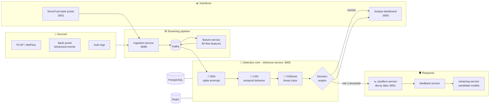
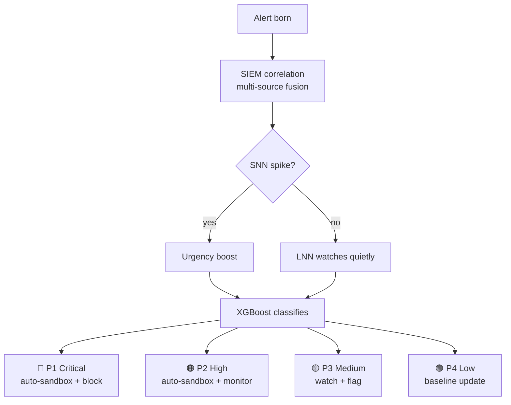
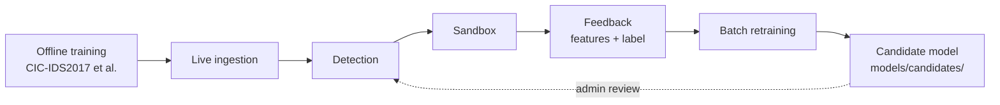
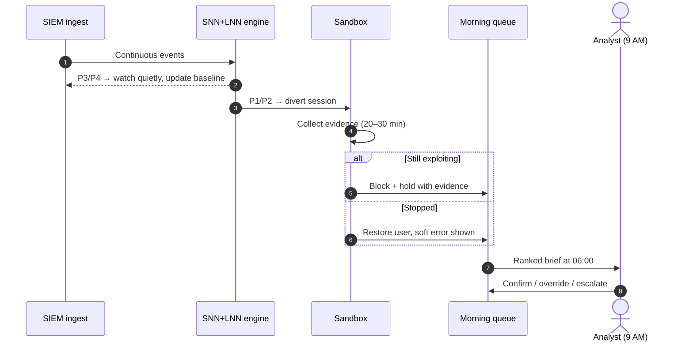

<div align="center">

<a id="top"></a>

# 🧠 NeuroSOC

### Neuromorphic AI Security Operations Center

*Thinking like a brain. Defending like a fortress.*

[](#-built-for-the-cyreneai-hackathon)
[](LICENSE)


**[Why NeuroSOC](#-why-neurosoc)** ·
**[Architecture](#️-architecture)** ·
**[Detection engine](#-snn--lnn-hybrid-engine)** ·
**[Live scenarios](#-real-world-flow-hacker-vs-forgetful-user)** ·
**[Quick start](#-quick-start)** ·
**[Project structure](#-project-structure)**

</div>

---

## 🏆 Built for the CyreneAI Hackathon

> [!NOTE]
> **NeuroSOC was built for the CyreneAI Hackathon.** It is an AI-first Security Operations Center that works like a tireless junior SOC analyst: it detects threats, triages alerts, moves suspicious sessions into a decoy sandbox overnight, and hands a human a short, evidence-backed queue in the morning.

**The pitch in 30 seconds:**

| | |
|---|---|
| 😩 **The problem** | SIEMs fire thousands of alerts a day. Analysts read a fraction, attackers hide in the noise, and nobody responds at 2 AM. |
| 💡 **Our answer** | A **Spiking + Liquid Neural Network** hybrid that scores each event against *that entity's own* behavior, then **acts on the result**: it sandboxes, deceives, collects evidence and reports. |
| 🎯 **The outcome** | The analyst starts the day with **about 10 pre-triaged cases with evidence** instead of 10,000 raw alerts, and still makes the final call. |

📘 **Detailed design doc:** [Google Docs](https://docs.google.com/document/d/1GcDYW006dY0nc87Vipmqk0Oph9lL2IFMOXp71v2yV8w/edit?tab=t.jpmwkbfntfso)

---

## 🧠 Why NeuroSOC

Traditional SIEMs (Splunk, QRadar, Microsoft Sentinel) and IDSs are **loud and passive**. They correlate logs, fire alerts and leave the rest to a human.

| Problem with classic SIEM / IDS | How NeuroSOC handles it |
|---|---|
| 10,000 alerts a day, of which the analyst reads 200 | The SNN + LNN hybrid reduces noise to ranked, actionable signals |
| An alert fires and the analyst investigates by hand | An alert fires and the system sandboxes the session and collects evidence |
| No action at 2 AM | An autonomous overnight loop acts; a human reviews the evidence at 9 AM |
| Can't tell a forgetful user from a hacker | The LNN builds a behavioral fingerprint for each entity over time |
| The SIEM only displays events | The system detects, decides, diverts, deceives and reports |

<p align="right"><a href="#top">⬆ back to top</a></p>

---

## 🏗️ Architecture



<details>
<summary><b>🔍 Expand the full platform diagram (ingestion → SIEM core → sandbox → morning review)</b></summary>

```text
╔═══════════════════════════════════════════════════════════════╗
║                      NEUROSOC PLATFORM                        ║
╠═══════════════════════════════════════════════════════════════╣
║  ┌─────────────────────────────────────────────────────────┐  ║
║  │               INGESTION LAYER                           │  ║
║  │  🏦 DB Query Logs    🌐 Network Packets  📋 Auth Logs   │  ║
║  │  ☁️  Cloud Trails    💻 Endpoint EDR     📡 Syslog      │  ║
║  │     → Secure read-only connectors (per source type)     │  ║
║  └──────────────────────────┬──────────────────────────────┘  ║
║                             ▼                                 ║
║  ┌─────────────────────────────────────────────────────────┐  ║
║  │           NORMALIZATION ENGINE                          │  ║
║  │  Raw events → versioned security-event schema           │  ║
║  │  Timestamp sync │ Dedup │ Enrichment │ Entity tagging   │  ║
║  └──────────────────────────┬──────────────────────────────┘  ║
║                             ▼                                 ║
║  ╔═════════════════════════════════════════════════════════╗  ║
║  ║        NEUROSOC SIEM CORE                               ║  ║
║  ║  EVENT STORE ───▶ CORRELATION ENGINE (rules + ML)       ║  ║
║  ║                        ▼                                ║  ║
║  ║  SNN + LNN HYBRID DETECTION                             ║  ║
║  ║   ⚡ SNN → spike-encodes events, fires on bursts        ║  ║
║  ║   🌊 LNN → continuous state, tracks behavior            ║  ║
║  ║                        ▼                                ║  ║
║  ║  ALERT ENGINE 🚨                                        ║  ║
║  ║   P1 🔴 CRITICAL → immediate sandbox + block            ║  ║
║  ║   P2 🟠 HIGH     → sandbox + monitor                    ║  ║
║  ║   P3 🟡 MEDIUM   → flag + watch for escalation          ║  ║
║  ║   P4 🟢 LOW      → log only, update baseline            ║  ║
║  ║                        ▼                                ║  ║
║  ║  CLASSIFICATION: Normal │ Notorious │ Insider │ Attacker║  ║
║  ╚════════════════════════╪════════════════════════════════╝  ║
║           ┌───────────────┴────────────┐                      ║
║   RISK < THRESHOLD              RISK ≥ THRESHOLD              ║
║   → normal service              → 🪤 HONEYPOT SANDBOX         ║
║                                   decoy data, full capture    ║
║                     ┌───────────────┴──────────────┐          ║
║              Keeps exploiting               Stops / lost      ║
║              [P1 → HACKER]              [P3 → verify user]    ║
║                                     ▼                         ║
║              📊 MORNING ANALYST DASHBOARD                     ║
║              Ranked queue │ Sandbox replay │ Override         ║
╚═══════════════════════════════════════════════════════════════╝
```

</details>

<details>
<summary><b>🚨 Expand the SIEM layer in depth: correlation, alert tiers, alert-fatigue controls</b></summary>

#### 1. Event correlation

Individual events are weak signals. The correlation engine links them across sources:

```text
Event A:  User "john" failed login         [alone: noise]
Event B:  Same IP queried /admin 3x        [alone: noise]
Event C:  New device fingerprint for john  [alone: noise]
────────────────────────────────────────────────────────
Correlated → "Credential stuffing on john" → P2 alert
```

#### 2. Alert tiers and lifecycle



#### 3. Alert-fatigue controls

- **SNN deduplication:** identical spike patterns within a time window collapse into one alert.
- **Baseline-relative scoring:** an event alerts only if it deviates from *that entity's* baseline, not from a global threshold.
- **Sandbox auto-triage:** P1/P2 alerts are handled overnight, so the morning queue holds *resolved cases with evidence*.

</details>

<p align="right"><a href="#top">⬆ back to top</a></p>

---

## 🔬 SNN + LNN Hybrid Engine

The core research idea is a detection engine that combines **Spiking Neural Networks** with **Liquid Neural Networks**:

| Model | Role | Implementation |
|---|---|---|
| ⚡ **SNN** | Encodes flow features as temporal spikes for fast, event-driven anomaly detection | Norse (PyTorch) · [`inference-service/core/snn`](inference-service/core/snn) |
| 🌊 **LNN** | Keeps a continuous-time state for each entity that tracks behavior as it evolves | Liquid reservoir + classifier · [`inference-service/core/lnn`](inference-service/core/lnn) |
| 🌳 **XGBoost** | Assigns the final threat class | [`inference-service/core/xgboost`](inference-service/core/xgboost) |
| 🧬 **Behavioral profiler** | Measures how far a session drifts from the user's own baseline | [`inference-service/core/behavioral`](inference-service/core/behavioral) |

```python
# Hybrid decision fusion (simplified)
snn_score   = snn_encoder.anomaly_score(packet_spike_train)
lnn_class   = lnn_classifier.predict(session_feature_sequence)
behav_delta = behavioral_profiler.get_delta(user_id, session_vector)

confidence  = 0.4 * snn_score + 0.4 * lnn_class + 0.2 * behav_delta
verdict     = decision_engine.classify(confidence, user_context)
```

<details>
<summary><b>📈 How the models behave in training and at runtime</b></summary>

| Model | Before ingestion | During runtime |
|---|---|---|
| **SNN** | Trained offline | Mostly static (fast inference) |
| **LNN** | Trained offline | Adaptive state (live context) |
| **XGBoost** | Trained offline | Retrained on a schedule from feedback |

**Closed learning loop:**



> [!IMPORTANT]
> Live inference must use exactly the same feature pipeline as training (80 CICFlowMeter-style features, MinMax scaling), or the models become invalid. Retraining only writes **candidate** artifacts. It never changes the active model, and reloading a model requires an OIDC **admin** token.

</details>

<p align="right"><a href="#top">⬆ back to top</a></p>

---

## 🔁 Real-World Flow: Hacker vs. Forgetful User

A hard operational problem is telling a **malicious actor** apart from a **legitimate user acting oddly**. Click a character to replay the 2 AM scenario:

<details>
<summary><b>👤 Normal user: Priya logs in from her usual phone at 10 PM</b></summary>

```text
→ Login from known device, known IP, normal hour
→ SNN: no spike  │  LNN: delta near zero
→ SIEM: no alert │  XGBoost: Normal
→ ✅ Access granted, event logged as P4 (baseline update)
```

</details>

<details>
<summary><b>🤦 Notorious user: Raj, an ex-employee who forgot he left</b></summary>

```text
→ Login attempt at 2 AM, wrong password ×3, old device
→ SNN: mild spike  │  LNN: moderate drift from Raj's baseline
→ SIEM: P3 alert, "Repeated fail, known device, off-hours"
→ XGBoost: Notorious (not attacker, low confidence)
→ After 5 attempts → escalates to P2 → sandbox shows "account locked"
→ Raj stops. Behavior fits confusion, not exploitation
→ 9 AM: analyst clicks [Restore] → password reset + 2FA
```

</details>

<details>
<summary><b>💀 External hacker: credential stuffing from a TOR exit node</b></summary>

```text
→ 2 AM, 400 login attempts/min across 80 accounts
→ SNN: MASSIVE spike  │  LNN: no history, unfamiliar trajectory
→ SIEM: P1, "Mass credential stuffing"
→ XGBoost: External attacker, confidence 0.97
→ All sessions silently diverted to the sandbox and shown a fake vault
→ Every action captured → attack pattern mapped → IOCs extracted
→ 9 AM: "Attack fully documented, 0 real data touched"
```

</details>

| Signal | Notorious user 🤦 | Hacker 💀 |
|---|---|---|
| Password failure speed | Human pace, gaps of about 10 s | Scripted, gaps under 100 ms |
| Device / IP history | Seen before | New, often TOR/VPN |
| Accounts targeted | Only their own | Many, including admin paths |
| Behavior after sandboxing | Stops and waits | Keeps probing and pivots |
| LNN behavioral delta | Low | High |
| Alert tier | P3 → P2 | P1 immediately |

<p align="right"><a href="#top">⬆ back to top</a></p>

---

## 🌙 Autonomous Overnight Loop



The sandbox threshold is configurable with `SANDBOX_CONFIDENCE_THRESHOLD`. The default is `0.50`.

<details>
<summary><b>📊 Preview the morning analyst briefing</b></summary>

```text
╔════════════════════════════════════════════════════════════════╗
║  NeuroSOC  |  Morning Briefing  |  09:00                       ║
╠════════════════════════════════════════════════════════════════╣
║  Total events ingested:      1,247,832                         ║
║  Correlated alert groups:    847                               ║
║  After SNN/LNN dedup:        23                                ║
║  Auto-triaged by AI:         21    ← analyst skips these       ║
║  Needs human review:          2    ← analyst reads these       ║
║  ────────────────────────────────────────────────────────────  ║
║  🔴 P1  Credential stuffing — 80 accts — BLOCKED  [RESOLVED]   ║
║  🟠 P2  Ex-employee Raj — 5 failed logins — HELD   [REVIEW]    ║
║         └─ [Restore Access]  [Keep Blocked]  [Escalate]        ║
║  🟡 P3  Unusual query pattern — user #4412         [WATCHING]  ║
╚════════════════════════════════════════════════════════════════╝
```

</details>

---

## 🖥️ What You Can Try

| Interface | URL | What it shows |
|---|---|---|
| 📊 **Analyst dashboard** | http://localhost:3000 | Overview (activity, threat map, model health), Intel Feed, Response Ops |
| 🏦 **NovaTrust bank portal** | http://localhost:3001 | Simulated bank with login, transfers, live verdicts and a system-flow view for red-team testing |
| 📘 **Inference API docs** | http://localhost:8000/docs | Versioned REST API (`/api/v1/*`) and the WebSocket alert stream (`/api/v1/ws/alerts`) |
| 🔐 **Keycloak** | http://localhost:8081/admin | `neurosoc` realm with `analyst`, `operator`, `admin` and `auditor` roles |
| 📈 **Grafana / Prometheus** | http://localhost:3002 · :9090 | Operational metrics (`ops` profile) |

> [!TIP]
> In the bank portal, try three personas: a **normal customer**, a **forgetful user** who mistypes their password, and an **attacker** who scripts logins. Watch each verdict appear live on the analyst dashboard.

---

## 🚀 Quick Start

**Prerequisites:** Docker with Compose, Node.js 20+, Python 3.11+ (only for training and tests), and about 16 GB of RAM.

```bash
git clone https://github.com/MUKUL-PRASAD-SIGH/Project_NeuroSOC.git
cd Project_NeuroSOC
cp .env.example .env
```

<details open>
<summary><b>▶️ Option A: Full demo stack (dashboard + bank portal)</b></summary>

```bash
docker compose --profile phase8plus --profile phase10plus --profile phase11plus --profile demo up -d --build
```

The bank simulation APIs are off by default. Set `ENABLE_SIMULATION_API=true` in `.env` **only for local demos**.

</details>

<details>
<summary><b>🧩 Option B: Pick services with Compose profiles</b></summary>

| Profile | Adds |
|---|---|
| *(none)* | Zookeeper, Kafka, PostgreSQL, Redis, ingestion, feature, inference |
| `phase8plus` | Feedback and retraining services |
| `phase10plus` | Sandbox service |
| `phase11plus` | Analyst dashboard |
| `demo` | Dashboard + NovaTrust bank portal |
| `local-identity` | Keycloak OIDC provider |
| `ops` | Prometheus + Grafana |

```bash
docker compose --profile local-identity up -d keycloak
```

</details>

<details>
<summary><b>🏋️ Option C: Train the models yourself</b></summary>

```bash
python datasets/preprocess.py
python retraining-service/train_snn.py --epochs 50
python retraining-service/train_lnn.py --epochs 30
python retraining-service/train_xgboost.py
```

Add `--smoke-test` to the SNN/LNN scripts for a quick sanity run. Trained artifacts are written as candidates. They are never promoted automatically.

</details>

<details>
<summary><b>🔐 Security and production configuration</b></summary>

To require Keycloak bearer tokens on protected inference routes:

```text
OIDC_ISSUER=http://keycloak:8080/realms/neurosoc
OIDC_AUDIENCE=neurosoc-dashboard
OIDC_REQUIRED=true
```

- `APP_ENV=staging` or `APP_ENV=production` refuses to start unless OIDC and CORS use HTTPS, the simulation APIs are off, and a non-demo PostgreSQL URL is configured.
- When the sandbox service is configured, staging/production also require the same randomly generated `SANDBOX_SERVICE_TOKEN` (at least 32 characters) in inference and sandbox; local/test can leave it blank.
- `CORS_ALLOWED_ORIGINS` accepts explicit HTTP(S) origins only. `TRUSTED_PROXY_IPS` accepts IPs or CIDRs only.
- Model reload and promotion endpoints are **admin-only**.
- With PostgreSQL configured, authentication, alert, response-action and model-change events are written to `security_audit_events`.
- Change the example passwords in `identity/realm-export.json` before using a shared environment.

</details>

<details>
<summary><b>🧪 Run the tests</b></summary>

```bash
pytest tests/
node --test tests/test_production_build_guard.mjs
python scripts/check_production_credential_patterns.py
npm --prefix dashboard run build
```

For the simulation portal build, set `VITE_USE_MOCKS=false` before running `npm run build` from `simulation_portal/`.
The CI workflow in [`.github/workflows/product-safety.yml`](.github/workflows/product-safety.yml) runs the backend suite, both production frontend builds, Docker image builds, Compose configuration validation, the build guard, credential scan, and per-image SPDX SBOM artifact generation.

</details>

<p align="right"><a href="#top">⬆ back to top</a></p>

---

## 📁 Project Structure

```text
Project_NeuroSOC/
├── ingestion-service/     # PCAP / NetFlow / bank-portal event intake → Kafka
├── feature-service/       # 80-feature flow extraction + scaling
├── inference-service/     # FastAPI core: SNN, LNN, XGBoost, behavioral profiler,
│   └── core/              #   decision engine, policy engine, OIDC auth, audit log
├── sandbox-service/       # Honeypot sandbox serving decoy data
├── feedback-service/      # Captures sandbox + analyst outcomes as labels
├── retraining-service/    # SNN / LNN / XGBoost training → candidate models
├── data_pipeline/         # Synthetic generator, risk scoring, trust + anti-poisoning layers
├── datasets/              # Dataset preprocessing
├── models/ · artifacts/   # Model manifests, scalers, trained weights
├── schemas/               # Versioned security-event JSON schemas
├── dashboard/             # React analyst dashboard (Vite + Tailwind)
├── simulation_portal/     # NovaTrust simulated bank portal (React + TS)
├── attack_patterns/       # Brute force, DDoS and SQLi simulators
├── identity/              # Keycloak realm export
├── monitoring/            # Prometheus config
├── scripts/ · tests/      # Build guards, credential scan, pytest suites
└── docker-compose.yml
```

---

## 🧩 Technology Stack

| Layer | Technology |
|---|---|
| **ML core** | Python 3.11, PyTorch 2.x, Norse (SNN), liquid reservoir LNN, XGBoost, scikit-learn |
| **Services** | FastAPI, Uvicorn, kafka-python, asyncpg |
| **Event pipeline** | Apache Kafka, PostgreSQL, Redis |
| **Frontends** | React 18, Vite, Tailwind CSS, Recharts, Leaflet |
| **Identity** | Keycloak (OIDC, RBAC) |
| **Ops** | Docker Compose, Prometheus, Grafana, GitHub Actions |

---

## 🗺️ Roadmap

- [x] SNN + LNN + XGBoost hybrid detection
- [x] Kafka streaming pipeline with versioned event schemas and idempotency IDs
- [x] Honeypot sandbox and feedback capture
- [x] Analyst dashboard and NovaTrust bank simulation
- [x] Keycloak OIDC, endpoint RBAC, admin-only model controls, audit log
- [x] Analyst alert decisions, model candidate approval/promotion/rollback, and dashboard bearer-token wiring
- [x] Per-alert feature explanations and Prometheus/Grafana overview
- [ ] Multi-tenant authorization, tamper-evident audit export, and retention policies
- [ ] Approved production dataset, model drift/fairness/adversarial evaluation, and reproducible training
- [ ] SIEM/EDR/ticketing connectors, incident runbooks, backup/restore drills, and load/security rehearsal

---

## 👥 Human-in-the-Loop by Design

NeuroSOC is **not** fully autonomous, by design. The AI handles the 2 AM edge cases and filters out alert noise. **A human makes the final call.**

| Responsibility | Owner |
|---|---|
| Real-time detection, sandboxing, P1/P2 triage | 🤖 AI (autonomous, fully logged) |
| Morning queue review, final block/restore decisions | 🧑‍💻 Human analyst |
| Policy and SIEM rule updates | 🧑‍💻 Human analyst |

---

<div align="center">

**Built with 🧠 for the CyreneAI Hackathon**

*NeuroSOC: because attackers adapt, and so should your defense.*

Licensed under [Apache 2.0](LICENSE)

<a href="#top">⬆ back to top</a>

</div>
